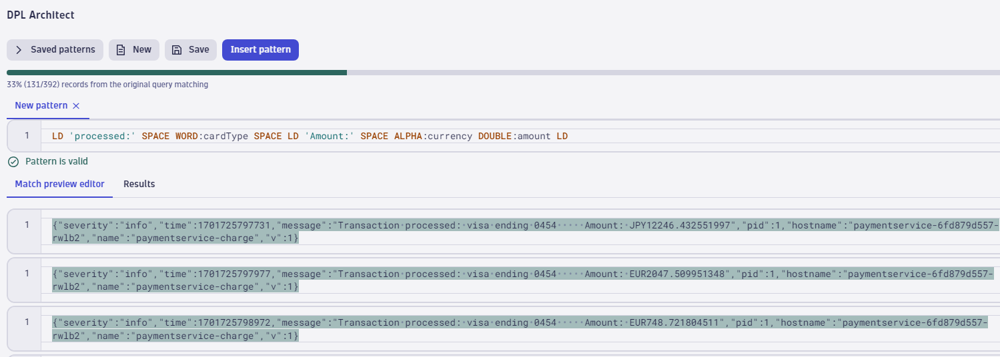
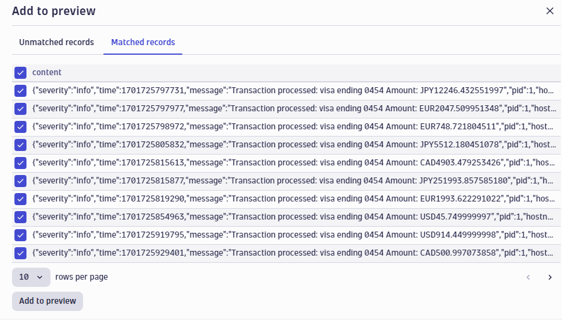
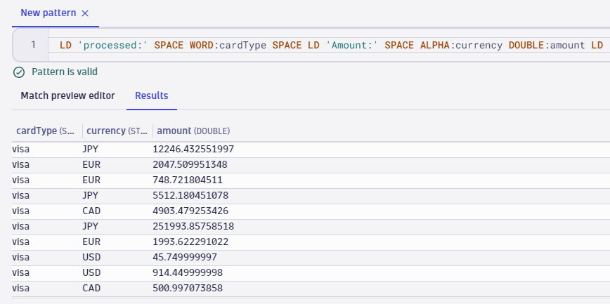
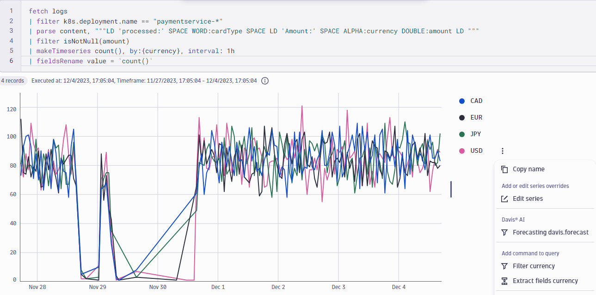
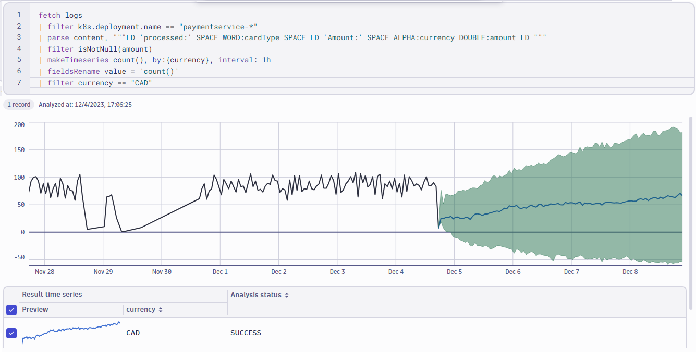
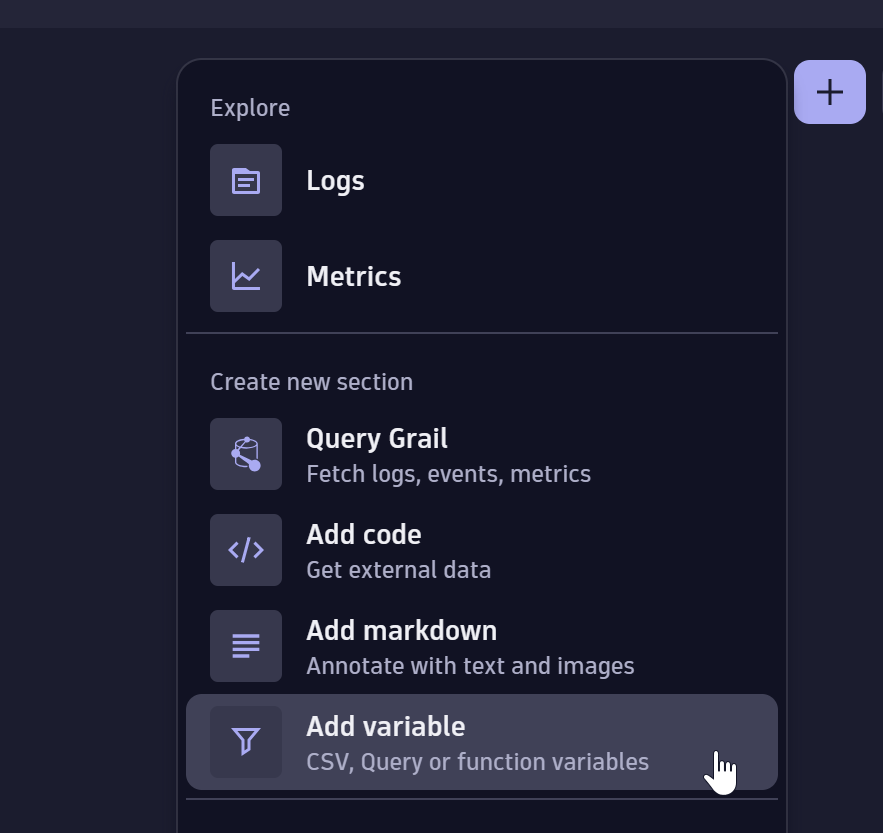
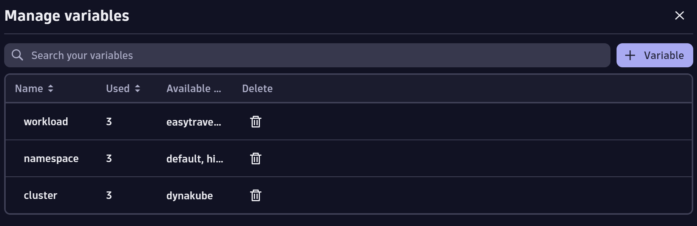

# Notebooks and Dashboards

The Dynatrace platform has introduced many new ways of visualizing all observability data. Both notebooks and dashboards have the same starting point of the `+` to add new widgets and sections. This lab is designed to introduce features of each App and highlight the best use cases for each different view.


# Notebooks

Notebooks provide a new interactive capability that allows users to explore logs & metrics via point & click, collaborate using code, provides access to custom analytics leveraging Grail, dynamically extract data from Grail data using the DPL architect, fetch external data using Typescript and API-driven analysis and provide context with annotation and rich text with markdown.

### DPL Architect

DPL architect is a handy tool available through the Notebooks app, which supports you in quickly extracting fields from records. It helps create patterns, provide feedback and allows you to save and reuse DPL patterns.
To open the DPL architect:

1. In a notebook, add a new section, select **Query Grail** and use the following query and click run.

```
fetch logs
| filter k8s.deployment.name == "paymentservice-*"
```

2. In the results section, select an interesting log entry click over the **content** field and select the **Extract fields** option from the pop-up menu. In this case look for an entry that contains the phrase "**Transaction processed**".
3. Use the expression editor to enter your schema pattern and start field extractions. If the pattern is in the correct format, **Pattern is valid** is displayed in green below the pattern section. If the pattern format contains errors, **Pattern error: …** indicates the line and position of the invalid element. Assuming we want to extract the type of card used, currency and amount going through our hipstershop, we can use the following pattern:

```
LD 'processed:' SPACE WORD:cardType SPACE LD 'Amount:' SPACE ALPHA:currency DOUBLE:amount LD
```

4. In this view you can write your own DPL expressions with result visualization in real time. Try adding/removing sections of this pattern to see how Dynatrace evaluates and reports the results of the new expressions.
   
5. On the top right section you have the option to **Add to preview** which adds additional lines from the base dataset. If needed, you can create additional records manually. After clicking the **Add to preview**, select the **Matched records** to make sure only relevant entries are imported, select all and click the **Add to preview**.
   
6. Adding extra records gives us a broader data set to make sure the results we are looking for are correct. Select the **Results** option to confirm the results. You can always save the resulting pattern to be used in the future using the **Save** option.
   
7. Once the results have been confirmed and the expresion is working as expected, we can insert this pattern directly into our DQL query using the **Insert pattern** option

### Forecasting

The forecast analysis predicts future values of any time series of numeric values. The forecast analyzer is not limited to stored metric data—you can bring your own data, use a metric query, or run a data query that results in a time series of numeric values. Now that we are extracting information from the payment perspective, we can use the forecasting capability to predict number of orders from the currency perspective.

1. In a notebook, add a new section, select **Query Grail** and use the following query and click run.

```
fetch logs
| filter k8s.deployment.name == "paymentservice-*"
| parse content, """LD 'processed:' SPACE WORD:cardType SPACE LD 'Amount:' SPACE ALPHA:currency DOUBLE:amount LD """
| filter isNotNull(amount)
| makeTimeseries count(), by:{currency}, interval: 1h
```

2. Make sure that you use a chart based visualization option, like the line or area chart to be able to visualize the trend of orders broken down by the currency.
3. From the dimension menu, select the currency you want to work with. In this case, I will use the **CAD** currency, hoover over your selection and using the elipsi icon, select the **Forecasting davis.forecast** option.
   
4. Once the analysis is over, set the timeframe to a more meaningful analysis timeframe. In this case I will use the last 7 days.
   
5. You can update your query to select a different currency, multiple currencies or remove the dimension definition to forecast the total orders across all geos.

# Dashboards

While notebooks are a persisted document and are designed for detailed analysis, documentation, and query development. Dashboards offer the same visualizations, greater flexibility with variable usage, and at a glance design approach.

The goal of this dashboard is to create a simplistic way to easily view log records and trends for different kubernetes workloads by utilizing Dashboard Variables.

1. Open the dashboards app and create a new dashboard with the `+ Dashboard` button in the top left.
2. Click on `Untitled Dashboard` and select `Rename Dashboard` and rename the dashboard to `Kubernetes Logs`.
3. Before we add data to our dashboard we will setup a new variable called `workload` to use in our queries.

4. Click on the `+` icon in the top right and select `Add Variable`
   
5. In the add variable diaglog, name the variable `workload` and make sure type is selected to `Query`.
6. Copy the below DQL query and paste into the Query section of the variable.

```
fetch dt.entity.cloud_application
| fieldsKeep entity.name
```

Here we are using the entity table to return the workload names in a dynamically populated list.

7. Run the query to ensure it returns workload names and enable the filter option of `Multi-select`. Save the new variable.
8. Create another variable called `namespace`. Use the query below to fetch namespace names. Enable `Multi-select`. Save the new variable.

```
fetch dt.entity.cloud_application_namespace
| fields entity.name
```

9. Create a third variable called `cluster`. Use the query below to fetch cluster names. Enable `Multi-select`. Save the new variable.

```
fetch dt.entity.kubernetes_cluster
| fields entity.name
```

You should now have 3 configured variables:


10. Click the `+` in the top right and select `Query Grail`.

Now we will build a DQL Query using our new variables as filters!

11. Label the tile `Most Recent Workload Variable Log Records`, then Copy and paste the following DQL Query into the query editor and click `Run`.

```
fetch logs
| filter isNotNull(dt.entity.cloud_application)
| fieldsAdd workload = lookup([fetch dt.entity.cloud_application], sourceField:dt.entity.cloud_application, lookupField:id)[entity.name]
| filter in(workload, $workload)
| fields timestamp, status, content, workload, k8s.namespace.name, dt.kubernetes.cluster.name
```

12. Expand the table to fit the width of the screen and place the tile below the header we just created.
13. Click the `+` icon select `Query Grail`.
14. Edit the newly created tile. Copy and Paste the following DQL Query into the query editor:

```
fetch logs
| filter in(dt.kubernetes.cluster.name, $cluster) and status == "ERROR"
| makeTimeseries count(), by:{k8s.namespace.name}, interval: 5m
```

15. Ensure the tile is selected in edit mode and in the right hand context menu, click on `Visualize` change the visualization type to `Line Chart`. Name the section `Cluster Level Error Records By Namespace`
16. Click on the `+` icon and select `Query Grail`. Name the tile `All Logs by Cluster & Namespace`. Then, copy and paste the following DQL Query into the query editor:

```
fetch logs
| filter in(dt.kubernetes.cluster.name, $cluster) AND in(k8s.namespace.name, $namespace)
| sort timestamp, desc
```

At this point, we should have a dashboard containing 3 tiles that looks similar to the screenshot below:


This completes the Notebooks and Dashboards lab. We've learned how notebook's offer the DPL architect for a parsing editor and forcasting options for timeseries based metrics. Dashboards offer variables which allow you to create highly dynamic queries and allow the user to change the query input without modifying the query!
