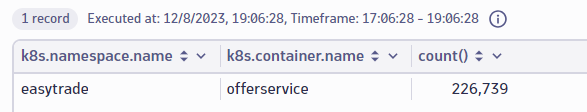
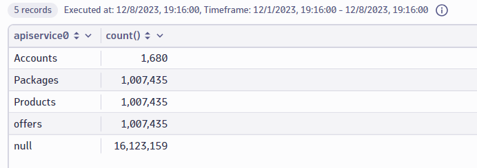
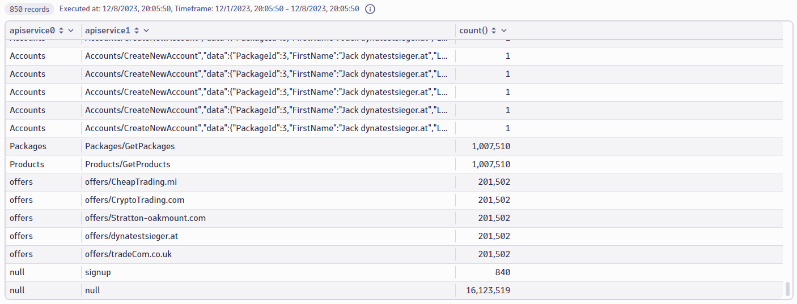
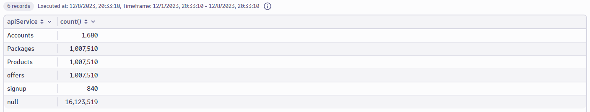
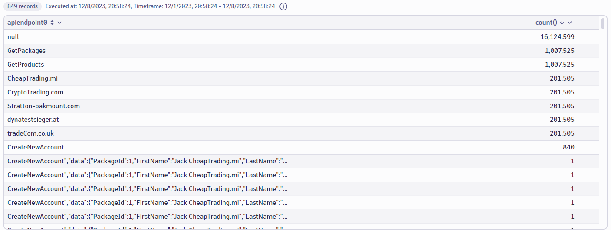
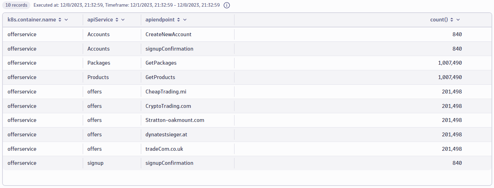
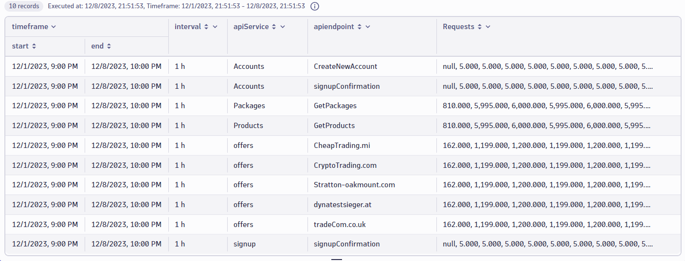
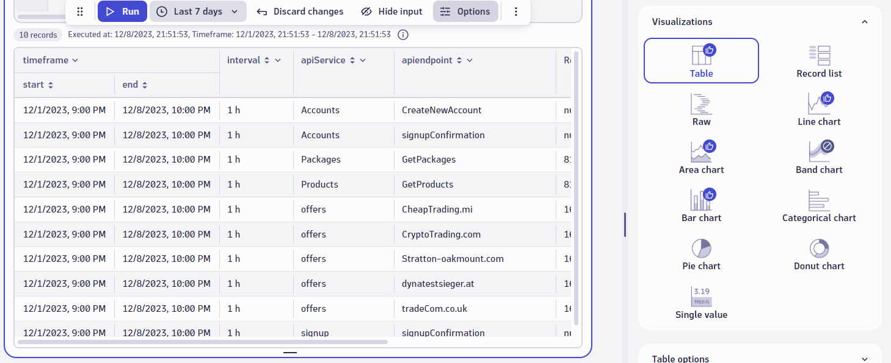
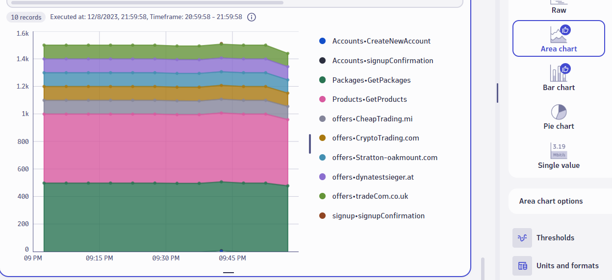

# Parsing and Trends

# Let's Parse Some JSON Real Quick
 Analyzing JSON objects and logs is very common. Let's warmup with a quick exercise to understand how you can parse JSON using DQL. Start by copying the following query.
 ```
fetch logs
| filter k8s.namespace.name == "easytrade" // filtering for a specific namespace
| filter contains(content,"Got offer response") // filtering for a specific log 
| parse content, " LD 'response [' JSON:request ']' EOF" // Parsing the content for the JSON object 
| fields Platform=request[platform], Price=request[packages][1][price], content // Assigning fields to a variable
| summarize averagePrice=AVG(Price), by:{Platform} // summarizing the sum of all prices by another field in the JSON object
```
The main takeaway from the above query is that we can reference the parsed field that is now a JSON object. Most use cases will be as simple as referencing the json field based upon your named entity.
 `json[field] `

For more complex use cases, reference the nested fields by using the field name followed by square brackets with the nested field name. 
 `json[field][nestedField][arrayitem][...] `

-----------------------------------------------------------------------------------------------------------------------------------------------------------

# Real World Scenario
Now let's tackle a scenario that requires us to combine our DQL knowledge and critical thinking to help out a developer in need. The goal of this lab is to be able to grab context from your conversations with your teams to write meaningful queries as well as learn how to manipulate the data to tell a clear story.

For this exercise we will leverage the following commands in a Notebook:
- `| parse `
- `| summarize`
- `| fieldsAdd`
- `| filterOut`
- `| makeTimeseries`

We will also leverage the if function:
- `if(condition, then [, else])`

# Set the Stage 
A developer joins a video call with you to understand more about their application. This is a newer developer that needs to understand load against the application's api for their team, but also, give marketing more insights about the recent offers that have been launched. The team member mentions that there are logs that the app produces, but isn't exactly sure how to make sense of the log files. Let's see how we can help them out by using the logs to find the amount of calls hitting the apis.

You may start by asking some questions about their app to pull out as much context as you can to help guide your query. A good place to start is asking, what application are you interested in?

*Answer: "We are responsible for the EasyTrade app that recently moved to a containerized environment"*

What context do we pull out of that? We just heard 'EasyTrade' and 'containerized'. This should tip us off that we can check cloud applications entity type in Dynatrace or straight up look at cloud workloads.
Here are the findings: An ***easytrade namespace*** exists in the ***dynakube*** K8s cluster. Let's start by finding logs that are able to be looked at.

Taking the context from the other lab, we know that there are logs from this namespace that we can query on:
```
fetch logs
| filter isNotNull(k8s.namespace.name) 
| summarize count(), by:{k8s.namespace.name}
```


Alas! The developer looks at your query results and says they are particularly interested in the offerservice. Let's get to it!

***Note: Summarizing your results is very helpful throughout this lab! No summarizations are needed to complete this lab, remember to take these out when moving to the next step.***
`| summarize count(), by:{field}`

# Part 1: Find the API Service Logs for Offers
Let's start by condensing our `| filter` and finding all of the different api services that hit the offerservice container

1. Filter on the easytrade namespace
2. Filter where the Kubernetes container name **offerservice** 
<H5><details>
<summary>Click to Reveal Solution</summary>
<br>
<br>

```
fetch logs
| filter k8s.namespace.name == "easytrade"AND k8s.container.name == "offerservice"
| summarize count(), by:{k8s.namespace.name,k8s.container.name} 
```
--OR--

```
fetch logs
| filter k8s.namespace.name == "easytrade" AND IN(k8s.container.name, {"offerservice"}) // for multiple criteria
| summarize count(), by:{k8s.namespace.name,k8s.container.name} 
```

</H5></details>

**Results**
<br>



# Part 2A: Parse it up
As we can see, there are patterns we can identify to get the api service that is being hit as well as endpoints that are being called. 

Use the `| parse` command to separate out the apiService
Example service: /api/**trade**/createNewTrade*

1. Select one of the logs to pull the data into the DPL architect and build the pattern that pulls out the http calls
2. Insert your pattern into the query using `| parse` and name your new field **apiservice0**

<details>
<summary>Hint</summary>
You may need to do a few summarizations and filters. When using different patterns that achieve the same result, it is helpful to use different field names.
</details>

<H5><details>
<summary>Click to Reveal Solution</summary>

```
fetch logs
| filter k8s.namespace.name == "easytrade" AND  IN(k8s.container.name ,{"offerservice"})
| parse content, "LD '/api/' LD:apiservice0 '/' "
//| summarize count(), by:{apiservice0} // Not needed, but easier to read
```

| Pattern | Description|
|:---|-----|
| `LD` | Represents Line Data before a matching pattern |
| `'/api/'`| Indicates a matcher up to the first occurence of the /api/ pattern |
| `LD:apiService0` | After meeting the matcher, take the Line Data that is present and add it to a field of the name of your choosing (type:aFieldName) | 
| `'/'` | The field I want to extract will end when I hit this other matcher|
</H5></details>
<br>


****Results summarized****



The developer looks at the results and mentions that there is a signup service he would also like to see as it should be in the same microservice

1. Select one of the logs to pull the data into the DPL architect and build the pattern that pulls out the http calls
2. Insert your pattern into your existing query with your fieldname as **apiservice1**
<details>
<summary>Hint</summary>
Use a filter on the content to find records that contain "signup" to get an idea what the other pattern would be

```
fetch logs
| filter k8s.namespace.name == "easytrade"AND k8s.container.name == "offerservice"
| filter contains(content, "signup")
```
| Function | Description|
|:---|-----|
| `contains(field,string)` | Contains the string you are looking for in a field that you want to search in |
</details>

<H5><details>
<summary>Click to Reveal Solution</summary>
<br>

```
fetch logs
| filter k8s.namespace.name == "easytrade" AND k8s.container.name == "offerservice"
| parse content, "LD '/api/' LD:apiservice0 '/' "
| parse content, "LD '/api/' LD:apiservice1 ']' "
//| summarize count(), by: {apiservice0, apiservice1} // Not needed, but easier to read
```
</H5></details>
<br>

****Results summarized****


# Part 2B: Combine the results 
Now that we have the correct apiServices identiifed, it is easy to tell that we need to combine the results into one field. You can achieve this be adding a new field called apiService. Focus specifically on `signup` in **apiservice1** to combine with the **apiservice0** results.
<details>
<summary>Hint</summary>

`| fieldsAdd`  
Can be used to add the field. You will need to assign using `if()` logic
| Function | Description|
|:---|-----|
| `fieldsAdd` | Add an additonal field to your query result |
| `if(expression, result, else:)` | Standard if else logic. Else can contain another if |
</details>

</details>

<H5><details>
<summary>Click to Reveal Solution</summary>
<br>

```
fetch logs
| filter k8s.namespace.name == "easytrade" AND k8s.container.name == "offerservice"
| parse content, "LD '/api/' LD:apiservice0 '/' "
| parse content, "LD '/api/' LD:apiservice1 ']' "
| fieldsAdd apiService = if(apiservice1=="signup", apiservice1, else:apiservice0)
//| summarize count(), by: {apiService} // Not needed, but easier to read
```
</H5></details>
<br>

****Results summarized****


# Part 2C: More parsing please
The developer is very excited, since this would have taken a very long time to do manually, so they decide to get a more senior engineer on to look at the results. They also find this very interesting but want to understand more about the endpoints that are hit to provide marketing more of an idea about how many offers are coming through the system as well as new accounts created. It seems that we already have the data, but we need to add an additional parsing pattern. An apiEndpoint example would be /api/Products/**GetProducts**

1. Develop your pattern directly in your query or use the DPL architect 
2. Add `| parse` to the query with the pattern and save it in a field called **apiendpoint0** 
</details>
<br>
<H5><details>
<summary>Click to Reveal Solution</summary>
<br>

```
fetch logs
| filter k8s.namespace.name == "easytrade" AND k8s.container.name == "offerservice"
| parse content, "LD '/api/' LD:apiservice0 '/' "
| parse content, "LD '/api/' LD:apiservice1 ']' "
| fieldsAdd apiService = if(apiservice1=="signup", apiservice1, else:apiservice0)
| parse content, "LD '/api/' LD '/' LD:apiendpoint0 ']' "
// | summarize count(), by: {apiendpoint0} // Not needed
```
</H5></details>
<br>

Question: Could the apiendpoint0 parse have been done another way? 
Answer: Yes, I technically could have done it in the first parse command.

****Results summarized****


# Part 2D: Clean up the results
Although we do not need to combine anything in this part, we do need to get rid of some data. The developers inform us that we do not need the null endpoints where there is no api service detected. Another thing to do is aggregate the endpoints that have embedded JSON into one result because it is a second call that confirms the data that was used for the account creation and should match the total count for CreateNewAccount and signup.

1. Use the `| FieldsAdd` command to conditionally clean up the **apiendpoint0** where the **Accounts** apiEndpoints. Call this field **apiEndpoint**
2. Filter out data where both **apiService** is null

<details>
<summary>Hint</summary>

This will require an else:if() expression. It will look like this:
`if(field == "string", field, else: if(field != "string", field, else:"AccountConfirmation"))`

`| filterOut` can be used in the next line of your query to get rid of the nulls. 

| Function | Description|
|:---|-----|
| `filterOut` | A command used to exclude data from your results |

</details>
<H5><details>
<summary>Click to Reveal Solution</summary>

```
fetch logs
| filter k8s.namespace.name == "easytrade" AND k8s.container.name == "offerservice"
| parse content, "LD '/api/' LD:apiservice0 '/' "
| parse content, "LD '/api/' LD:apiservice1 ']' "
| parse content, "LD '/api/' LD '/' LD:apiendpoint0 ']' "
| fieldsAdd apiService = if(apiservice1=="signup", apiservice1, else:apiservice0)
| fieldsAdd apiendpoint = if(apiendpoint0 =="CreateNewAccount", apiendpoint0, else: if(apiservice0 != "Accounts", apiendpoint0, else:"signupConfirmation"))
| filterOut isNull(apiService) 
// | summarize count(), by:{k8s.container.name, apiService, apiendpoint} // Note needed. I added the container name so it looks cooler
```
</H5></details>


**Results summarized**



# Part 3: Visualize your data
Now that you are basically a magician, this last step will be to visualize this data by making a metric out of thin air. We will leverage the `| makeTimeseries` command in the last line of our query to see trends over time. 

<H5><details>
<summary>Click to Reveal Solution</summary>

```
fetch logs
| filter k8s.namespace.name == "easytrade" AND k8s.container.name == "offerservice"
| parse content, "LD '/api/' LD:apiservice0 '/' "
| parse content, "LD '/api/' LD:apiservice1 ']' "
| parse content, "LD '/api/' LD '/' LD:apiendpoint0 ']' "
| fieldsAdd apiService = if(apiservice1=="signup", apiservice1, else:apiservice0)
| fieldsAdd apiendpoint = if(apiendpoint0 =="CreateNewAccount", apiendpoint0, else: if(apiservice0 != "Accounts", apiendpoint0, else:"signupConfirmation"))
| filterOut isNull(apiService) 
| makeTimeseries Requests=count(), by:{apiService, apiendpoint}, time:timestamp, interval:1h

```
</H5></details>

**Results** (**POOF!**)






Lab Complete