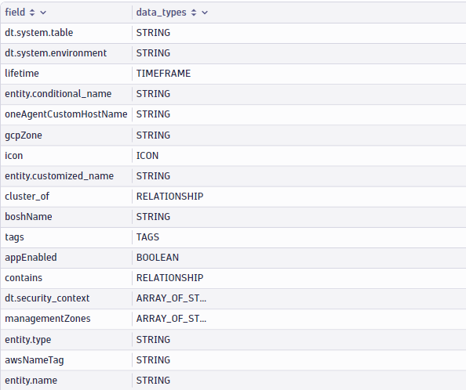
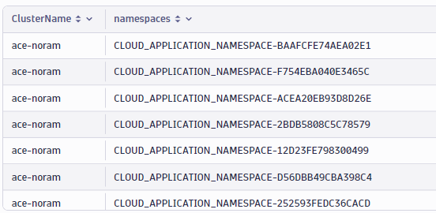
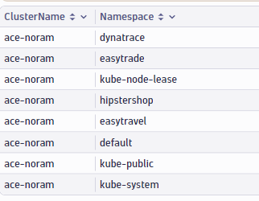
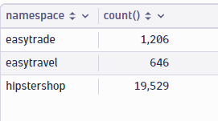
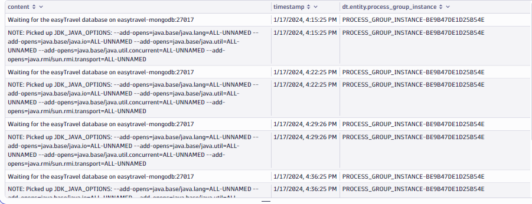
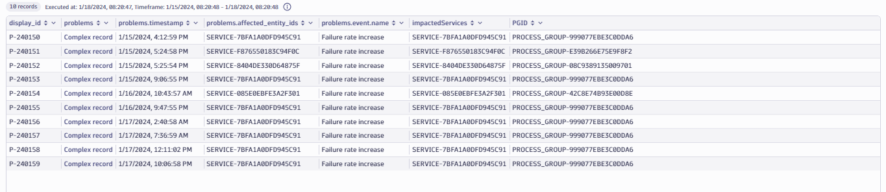
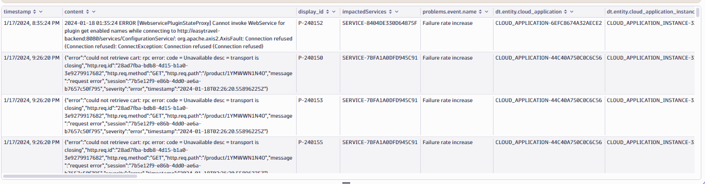

## Hands-On Exercise - Entities and Logs

In this section, we will focus on understanding the Dynatrace entity model and look at examples of querying log data based on the underlying entity properties, metadata and entity relationships.

For these exercises, you will use the lab environment/tenant available in your DTU environments section.  Navigate to that environment and create a new notebook.

---

### Step 1: Describe Entities

The **describe** command can be used to query information about the schema of a datatype. This command will return the fields associated with a datatype/entity.

Let's query the Kubernetes cluster entity type and review available fields


In a notebook, add a new section, select **Query Grail** and copy the following query and click run.

```
describe dt.entity.kubernetes_cluster
```

<H4> Expected Result:

<br>



</H4>

### Step 2: Query Kubernetes cluster entity along with underlying properties and relationships

From the previous describe command result, you see that the Kubernetes cluster entity has several properties such as id, name as well as relationships fields. 

Let's use the 'fetch' command to list all the K8s clusters in our environment. By default any fetch dt.entity.* command returns the id and name

Add a new section in your notebook and copy the following fetch command
```
fetch dt.entity.kubernetes_cluster
```

<H4> Expected Result:

<br>


</H4>

Next, let's write a query to fetch the namespaces contained within a Kubernetes cluster.  To retrieve the namespaces within a cluster we use the 'cluster_of' relationship field. 

Since a single K8s cluster can contain multiple namespaces, the cluster_of[dt.entity.cloud_application_namespace] relationship returns an array of namespace IDs. To retrieve each namespace ID as a seperate row, we use the'expand' command 
```
fetch dt.entity.kubernetes_cluster
|fields ClusterName=entity.name, namespaces=cluster_of[dt.entity.cloud_application_namespace]
|expand namespaces
```
<H4> Expected Result:

<br>



<br>

</H4>

The above result set contains namespace Ids instead of namespace names. To see the actual namespace name, you will need to query the dt.entity.namespace entity.

Add a new section to your notebook and run the following query:
```
fetch dt.entity.cloud_application_namespace
|fields id, entity.name

```

<H4> Expected Result:

<br>


</H4>

Instead of querying the dt.entity.kubernetes_cluster and dt.entity.namespace entities seperately, it would be preferred to have the namespace name returned while fetching data from the Kubernetes cluster entity. 

In such cases, we can use the 'lookup' command to add fields from a subquery to the source query. To use the 'lookup' command we need to find a match between a field in the source table and the lookup table.

In our case, the namespace id returnd by the 'cluster_of' relationship is the matching field to join the dt.entity.kubernetes_cluster and dt.entity.namespace entities

Useful link: https://docs.dynatrace.com/docs/shortlink/correlation-and-join-commands#lookup

Add a new section to your notebook and run the following command:
```
fetch dt.entity.kubernetes_cluster
|fields ClusterName=entity.name, namespaces=cluster_of[dt.entity.cloud_application_namespace]
|expand namespaces
|lookup [fetch dt.entity.cloud_application_namespace| fields id, namespace_name=entity.name], sourceField:namespaces, lookupField:id
|fields ClusterName, Namespace=lookup.namespace_name

```

<H4> Expected Result:

<br>



</H4>

Now that we know how to query entites and join related entities. 

Let's look at an example to query count of error logs and group them by namespace name

Add a new section to your notebook and use 'fetch' command to fetch logs where STATUS=="ERROR". Use 'summarize' command to count error logs and group them by namespace

Hint: Use 'lookup' command to fetch the namespace name.

```
fetch logs
|filter status=="ERROR" and isNotNull(dt.entity.cloud_application_namespace)
|lookup [fetch dt.entity.cloud_application_namespace], sourceField:dt.entity.cloud_application_namespace, lookupField:id, fields:{namespace=entity.name}
|summarize count(), by:{namespace}

```

<H4> Expected Result:

<br>



</H4>

---
### Step 3: Fetch logs based on entity properties

In this section, let's look at querying logs based on entity tags and properties.

As discussed in the introduction, logs are enriched by attributes. One such log attribute is the dt.entity.process_group_instance which connects logs to underlying process group instance. In this exercise, we will write a query to fetch logs based on process tags

Add a new section to your notebook and  write a query to fetch all logs running on processes that have tag Tier:Backend. 


```
fetch logs
|filter dt.entity.process_group_instance in 
        [fetch dt.entity.process_group_instance
        |expand tags
        |filter tags== "Tier:Backend"
        | fields id]
|fields content, timestamp, dt.entity.process_group_instance
|limit 10
```
Note the use of 'in' operator in the above query. The 'in' comparison is used when you want to evaluate the occurence of left hand side field/expression in a list of values returned by right hand side subquery.

<H4> Expected Result:

<br>



<br>

</H4>

---
### Step 4: Correlating logs and problem events
In this section, we will focus on querying logs for entities impacted by problems. Specifically let's look at problems impacting services and query the underlying error logs.

To achieve this, the two main tables we need to query are logs table and events table and join the two on a matching field. 

In the logs table, we are specifically looking for error logs. Let's first write a query to fetch error logs

```
fetch logs
|filter loglevel=="ERROR"
```

Next we need to find a matching field between logs and events table. Since we are focussing on service level problems, we need to find a match between impacted services and the logs. Logs has a 'dt.entity.process_group' attribute and the service entity also has a 'runs_on' relationship that returns underlying processgroup. Our goal is to query for Davis problems where the impacted entity is service and then retrive the process group ids of these services and match them with the 'dt.entity.process_group' attribute of the logs table to retrieve error logs

The next query block here fetches events, filtering specifically for 'DAVIS_PROBLEM' and where affected_entity_ids contains 'SERVICE-'. We then use the 'takeMax()' function to retrieve the latest problem record and group by display id.

From the list of problem records, we extract the affected_entity_ids(impactedServices). We then use the ids of the impactedServices to 'lookup' the underlying process group id. This query returns display_id of the problem, problem event name, imoacted service and underlying process group Id.

<br>

```
fetch events
      |filter event.kind=="DAVIS_PROBLEM" and matchesPhrase(affected_entity_ids, "SERVICE-")
      |summarize{problems=(takeMax(record(timestamp, affected_entity_ids, event.name))), by:{display_id}}
      |fieldsFlatten problems
      |expand impactedServices=problems.affected_entity_ids
      |fieldsAdd display_id, impactedServices, problems.event.name, PGID=lookup([fetch dt.entity.service| fields id, pg=runs_on[dt.entity.process_group]],sourceField:impactedServices, lookupField:id)[pg]
```

<H4> Expected Result:

<br>



</H4>

Now that we have the process_group ids of impacted services, we will use the 'JOIN' command to join our logs and events table. We are using the inner join. This command produces an output record whenever a record on the left side matches a record on the right side based on the join condition. 

Syntax for join: | join joinTable [, kind] , on: condition, … [, prefix] [, fields: { [field, …] }]

Note: Since the field names in our left table and right table are different, i.e. in logs table the field name is 'dt.entity.process_group' and in the above events query the field name is 'PGID', we will use this syntax for on clause - | join [...] on:left[dt.entity.process_group] == right[PGID]

Copy the below query and run it in a new section in your Notebook
<br>

```
fetch logs
|filter loglevel=="ERROR"
|join [fetch events
      |filter event.kind=="DAVIS_PROBLEM" and matchesPhrase(affected_entity_ids, "SERVICE-")
      |summarize{problems=(takeMax(record(timestamp, affected_entity_ids, event.name))), by:{display_id}}
      |fieldsFlatten problems
      |expand impactedServices=problems.affected_entity_ids
      |fieldsAdd display_id, impactedServices, problems.event.name, PGID=lookup([fetch dt.entity.service| fields id, pg=runs_on[dt.entity.process_group]], sourceField:impactedServices, lookupField:id)[pg]],
kind:inner,
on:{left[dt.entity.process_group] == right[PGID] }, fields:{display_id, impactedServices, problems.event.name}
```

Useful link: https://docs.dynatrace.com/docs/platform/grail/dynatrace-query-language/commands/correlation-and-join-commands

<H4> Expected Result:

<br>



</H4>