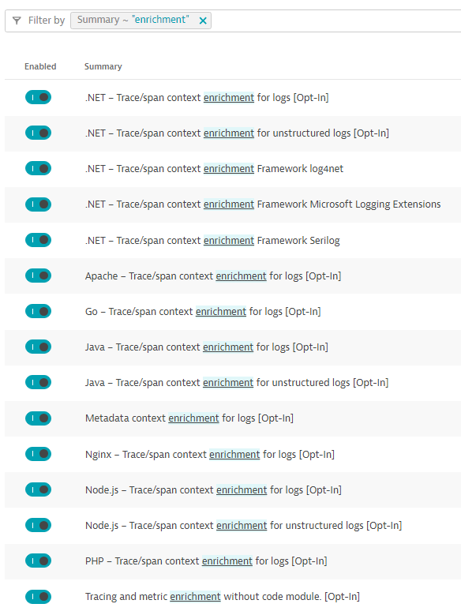
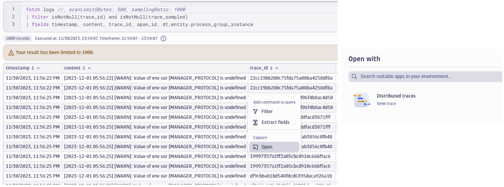
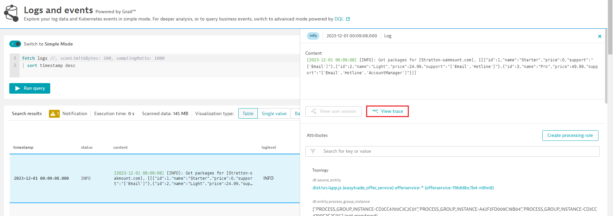
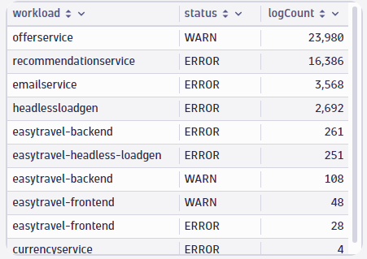
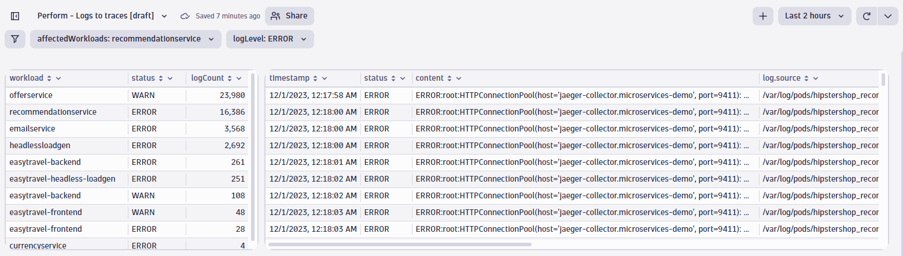
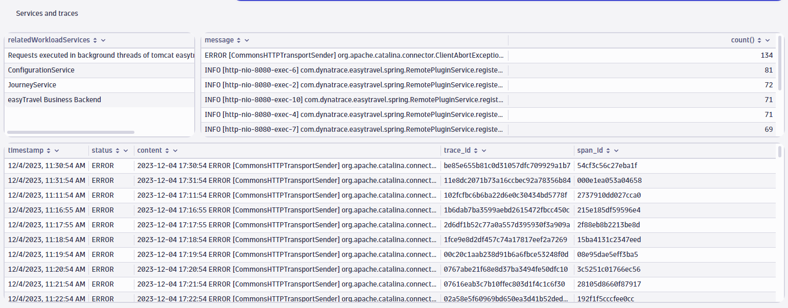

# Logs to traces 
The idea behind this lab is to create from scratch a dashboard that can be used in any Dynatrace environment that has kubernetes workloads in place.

We will leverage dashboard features like variables based on DQL queries and differente visualizations to be able to indentify potential affected workloads across the environment, and more importantly be able to drill-down directly from a log entry directly to a trace.

This dashboard can be downloaded from this environment and imported into another for later review.

### Step 1 - Dynatrace configuration

Dynatrace requires log data to be enriched with additional information that helps recognize, correlate and evaluate the data, which results in a more refined analysis of logs. Automatically connecting log data to traces works for all log data, no matter how the log data was ingested. The key concept is that the log data is enriched, either manually by adding [specific fields](https://docs.dynatrace.com/docs/shortlink/lma-log-enrichment) required for correlation or allowing Dynatrace OneAgent to automatically add this same information.

1. In the Dynatrace menu, go to Settings and select Preferences > OneAgent features.
2. Filter for enrichment.
3. Enable/disable each log enrichment for each technology that you use to generate ingested log data.
4. Select Save changes to save your configuration.
5. Restart your monitored applications.



### Step 2 - Confirm log enrichment

If automatic log enrichment wasnt enable in your Dynatrace environment, you will need to restart your monitored applications after enabling these configurations to make sure the OneAgent can start enriching the ingested log data. There is an easy way to confirm that the enrichment, and the drill-down log -> trace or trace -> log is working.

1. Look for the newly added fields in your log data: dt.trace_id, dt.span_id and dt.entity.process_group_instance. You can run this query in the log and events viewer, notebook or dashboard:
```
fetch logs //, scanLimitGBytes: 500, samplingRatio: 1000
| filter isNotNull(trace_id) and isNotNull(trace_sampled)
| fields timestamp, content, trace_id, span_id, dt.entity.process_group_instance
```


2. This enrichment now allow us to drill-down directly to the correlating trace direclty from your favorite data visualization (Notebooks, dashboards or log and events viewer).
3. In dashboards/notebooks, you can click on the **trace_id** column in the log entry you are interested on, select **Open** and the resulting view allows you to drill-down directly to the trace.

5. In the log and events viewer, select the log entry you are interested on, and in the context menu that displays, select the **View trace** option. 


### Step 3 - Most affected k8s workloads

The first thing we want to display is which are the most affected k8s workloads based on log data. In this case, what we are looking for is a summary of workloads that report the highest number of **ERROR** and **WARNING** level logs.

We will use this same concept to create our first variable for our dashboard that will allow us to focus on any of these workloads and report only related log entries for the affected workload.

1. The first thing we will do is summarize our workloads based on the number of error/warning log levels. 

```
fetch logs, scanLimitGBytes: 500, samplingRatio: 1000
| filter status != "INFO" AND status!= "NONE"
| fieldsRename workload = k8s.container.name
| filter isNotNull(workload)
| summarize logCount = count(), by:{workload, status}
| sort logCount desc
```
We are making sure we are not adding **INFO** and **NONE** log levels. Depending on your own needs, this filter can be expanded to meet specific criteria.



Using the same principle, we will create a variable to be able to select the workload we want to retrieve queries from. The table can be used as a supporting source to quickly identify which are the workloads that might be affected by a problem based on the number of critical logs being reported. We can combine this priciple with the log level(s) that we want to retrieve for our selected workload:

Affected workload
```
fetch logs //, scanLimitGBytes: 500, samplingRatio: 1000
| filter status != "INFO" AND status!= "NONE"
| summarize count(), by:{k8s.container.name, status}
| sort `count()` desc
| fields k8s.container.name
```
Log level
```
fetch logs //, scanLimitGBytes: 500, samplingRatio: 1000
| summarize count(), by: {loglevel}
| fields loglevel
```

Using these variables, we can create a simple table view to start looking into potential problems based on log data, with the option to focus on a specific log level:

```
fetch logs //, scanLimitGBytes: 500, samplingRatio: 1000
| filter k8s.container.name == $affectedWorkloads and in(status, $logLevel)
| fieldsadd host.group = lookup ([fetch dt.entity.host_group], sourceField:dt.entity.host_group, lookupField:id)
| fields timestamp, status, content, log.source, dt.process.name, host.name, k8s.container.name, k8s.namespace.name, host.group.name = host.group[entity.name]
```


### Step 4 - Service insights

Now that we have a way of tracking most affected workloads based completely on log data, and with the configuration changes implemented to enrich logs, we can do very interesting things from the service and log perspective.

1. The first thing that we can do is list the related services based on the affected workloads. The idea here is to focus on the affected workloads using the previously defined variable, to understand the potential services that might contain critical log information. 

```
fetch logs
| filter k8s.container.name == $affectedWorkloads
| lookup [fetch dt.entity.process_group | expand services = runs[dt.entity.service]], lookupField: id, sourceField:dt.entity.process_group
| fields ids = lookup.runs[dt.entity.service]
| summarize servicesArray = collectDistinct(ids)
| expand temp = servicesArray
| expand servicesList = temp
| lookup [fetch dt.entity.service], sourceField:servicesList, lookupField:id 
| fieldsRename temp = lookup.entity.name
| fieldsAdd relatedWorkloadServices = if(isNull(temp), "No services", else: temp)
| fields relatedWorkloadServices
```
2. We also want to make sure that we provide a summary of the most common type of messages, based on selected log levels, related to the selected workload. This gives us a high level idea of which are the most common log entries being reported by your workloads
```
fetch logs
| filter k8s.container.name == $affectedWorkloads AND isNotNull(trace_id) AND in(loglevel, $logLevel)
| fieldsadd host.group = lookup ([fetch dt.entity.host_group], sourceField:dt.entity.host_group, lookupField:id)
| parse content, "'['? TIMESTAMP ']'? LD:messageEOL EOL" 
| parse content, "'['? TIMESTAMP ']'? LD:messageNoEOL" 
| parse content, "LD SPACE LD SPACE LD:messageWeirdDate" 
| fieldsAdd message = coalesce(messageEOL,messageNoEOL,messageWeirdDate)
| summarize count(), by:{message}
| sort `count()` desc
```
3. Naturally, we also want to make sure we can use these relevant log entries to be able to drill-down directly to a trace, which can also lead us to the overview of the related service. **In this view, we can click on the value of the 'trace_id' to drill-down directly to the trace.**
```
fetch logs
| filter k8s.container.name == $affectedWorkloads AND isNotNull(trace_id) AND in(loglevel, $logLevel)
| fieldsadd host.group = lookup ([fetch dt.entity.host_group], sourceField:dt.entity.host_group, lookupField:id)
| fields timestamp, status, content, trace_id, span_id
```

